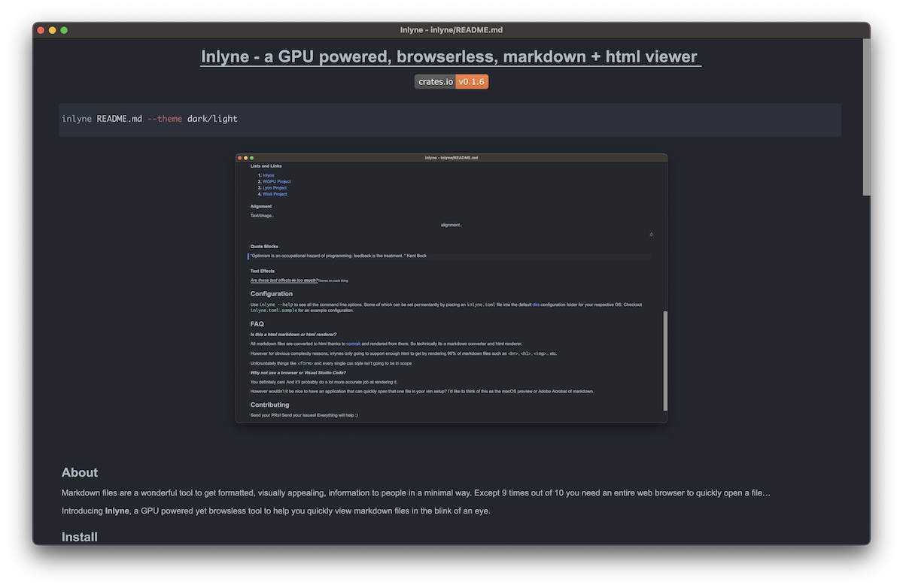

<h1 align="center">Inlyne - a GPU powered, browserless, markdown + html viewer</h1>

<p align="center">
<a href="https://crates.io/crates/inlyne" target="_blank"></a>
</p>

```bash
inlyne README.md --theme dark/light
```

<p align="center">

</p>

## About

Markdown files are a wonderful tool to get formatted, visually appealing, information to people in a minimal way.
Except 9 times out of 10 you need an entire web browser to quickly open a file...

Introducing **Inlyne**, a GPU powered yet browserless tool to help you quickly
view markdown files in the blink of an eye 👀.

## Install

To install just use `cargo install inlyne`, everything comes pre-bundled.

## Features

Over time the features of this application will continue to grow. However there are a few
core features that will remain at the heart of the project.

- **Browserless** - People shouldn't need electron or chrome to quickly view markdown files in a repository.
- **GPU Powered** - Thanks to the [WGPU Project](https://github.com/gfx-rs/wgpu) rendering can and will be done
as much on the GPU as we can get away with.
- **Basic HTML Rendering** - HTML is used in almost all project markdown files, thus having the bare minimum html to
support common use cases is necessary, but don't expect forms and buttons.
- **Live Code Change** - Inlyne will monitor your markdown file for any write modifications and automatically refresh
the document where you left off. It's designed to work seamlessly and allow you to make edits on the fly.

## What does it support?

#### Tables
| Super cool tables | For organising data|
|-------------------|--------------------|
| Favourite band    | Nickleback         |

#### Sizable images
</img>

#### Code Blocks (with syntect highlighting)
```rust
// Code thats drawing this text
let bounds = (screen_size.0 - pos.0 - DEFAULT_MARGIN, screen_size.1);
self.glyph_brush.queue(&text_box.glyph_section(*pos, bounds));
```

#### Lists and Links


<ol>
    <li><a href="https://github.com/trimental/inlyne">Inlyne</a></li>
    <li><a href="https://github.com/gfx-rs/wgpu">WGPU Project</a></li>
    <li><a href="https://github.com/nical/lyon">Lyon Project</a></li>
    <li><a href="https://github.com/rust-windowing/winit">Winit Project</a></li>
</ol>

#### Tasklists

- [x] Watch Game of Thrones
- [ ] Feed the cat

#### Hideable sections
<details>
<summary>Click me to show text</summary>

You weren't supposed to see this!
</details>

#### Alignment
<p align="left">Text/Image..</p>
<p align="center">alignment..</p>
<p align="right">:)</p>

#### Quote Blocks

> “Optimism is an occupational hazard of programming: feedback is the treatment. “ Kent Beck

#### Text Effects

<small><i><u>Are these text effects ~~to~~ too **much**?</u></i> Theres no such thing</small>

## Configuration

Use `inlyne --help` to see all the command line options. Some of which can be set permentantly by placing an `inlyne.toml` file into the default [dirs](https://crates.io/crates/dirs) configuration folder for your respective OS. Checkout `inlyne.toml.sample` for an example configuration.

## FAQ


**_Is this a html markdown or html renderer?_**

All markdown files are converted to html thanks to [comrak](https://github.com/kivikakk/comrak) and rendered from there. So technically its a markdown converter and html renderer.

However for obvious complexity reasons, inlynes only going to support enough
html to get by rendering 95% of markdown files such as `<br>`, `<h1>`, ``.. etc. 

Unforuntately things like `<form>` and every single css style isn't going to be in scope

**_Why not use a browser or Visual Studio Code?_**

You definitely can! And it'll probably do a lot more accurate job at rendering it. 

However wouldn't it be nice to have an application that can quickly open that one file in your vim setup? I'd like to think of this as the macOS preview or Adobe Acrobat of markdown.

## Contributing

Send your PRs! Send your issues! Everything will help :)

## License

Any code that you can in this repository, you can copy under the MIT license.

[MIT License](https://github.com/trimental/inlyne/blob/master/LICENSE)
